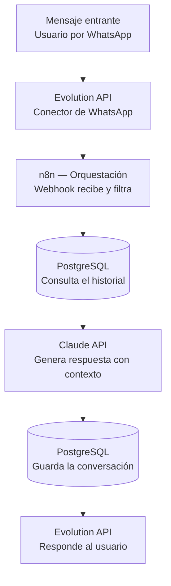

# Bot de Atención WhatsApp con IA

Bot conversacional de atención al cliente para WhatsApp, con **memoria de conversación persistente** e integración de un modelo de lenguaje (LLM) para generar respuestas contextualizadas. Desplegado en infraestructura propia containerizada con Docker.

> Pensado como servicio recurrente para pymes y comercios locales: un asistente que responde 24/7 por WhatsApp manteniendo el hilo de cada conversación.

---

## El problema que resuelve

Los comercios pierden consultas fuera de horario y dedican horas a responder lo mismo una y otra vez. Este bot atiende automáticamente por WhatsApp, recuerda el contexto de cada cliente y deriva a un humano cuando hace falta, sin que el negocio tenga que estar pendiente del teléfono.

---

## Arquitectura

Un mensaje recorre el sistema de punta a punta así:



El orquestador es **n8n**: recibe el mensaje por webhook, recupera el historial de la conversación desde PostgreSQL, arma el contexto, llama a la API del LLM, persiste la nueva interacción y envía la respuesta de vuelta por WhatsApp.

---

## Stack técnico

| Capa | Tecnología |
|------|------------|
| Orquestación | n8n |
| Conector WhatsApp | Evolution API |
| Modelo de lenguaje | Claude API (Anthropic) |
| Persistencia / memoria | PostgreSQL |
| Cache | Redis |
| Reverse proxy + HTTPS | Caddy |
| Contenedores | Docker / Docker Compose |
| Infraestructura | VPS (Linux) |

Todos los servicios corren como contenedores Docker orquestados con Docker Compose, detrás de un reverse proxy con HTTPS automático.

---

## Cómo funciona la memoria

Cada mensaje (entrante y saliente) se guarda en una tabla `conversaciones` en PostgreSQL, asociado al número del usuario. Antes de cada respuesta, el flujo recupera el historial reciente de ese número y lo envía al modelo como contexto. Así el bot "recuerda" la conversación en lugar de tratar cada mensaje de forma aislada.

```
conversaciones
├── id           SERIAL
├── numero       VARCHAR    -- identifica al usuario
├── mensaje      TEXT       -- lo que escribió el usuario
├── respuesta    TEXT       -- lo que respondió el bot
├── rol          VARCHAR    -- user / assistant
└── creado_en    TIMESTAMP
```

---

## Decisiones técnicas y problemas resueltos

Algunos de los desafíos reales que aparecieron al construirlo y cómo los resolví:

- **Selección de imagen de Evolution API.** La imagen más popular tenía un bug en la generación del QR de vinculación (devolvía un resultado vacío). Lo diagnostiqué probando una versión específica estable que sí funcionaba, en lugar de quedarme con la imagen por defecto.

- **Configuración del webhook por instancia.** En la versión usada, la config global de webhook no se propagaba a las instancias nuevas. La resolví seteando el webhook por instancia vía API.

- **Timeouts entre contenedores.** Usar la URL pública para la comunicación interna entre servicios provocaba timeouts. Lo solucioné usando la red interna de Docker (resolución por nombre de servicio) en lugar de salir y volver a entrar por la URL pública.

- **Cortes del flujo con resultados vacíos.** Cuando un usuario escribía por primera vez, la consulta de historial no devolvía filas y el flujo se cortaba. Lo arreglé ajustando el nodo para que siempre emita datos aunque la consulta venga vacía.

---

## Estado del proyecto

Funcional y desplegado en producción sobre un número de WhatsApp de prueba. En evolución hacia:

- [ ] Base de conocimiento por cliente (RAG) para responder con información propia del negocio
- [ ] Panel de configuración por cliente
- [ ] Derivación a humano según intención detectada

---

## Sobre este repositorio

Este repo documenta la arquitectura y las decisiones de diseño del proyecto. Por seguridad no incluye credenciales, claves de API ni la configuración del servidor de producción.

**Autor:** Javier Somosa — Desarrollador Backend orientado a IA aplicada
[LinkedIn](https://www.linkedin.com/in/javiersomosa) · [Agencia DVS](https://agenciadvs.com.ar)
